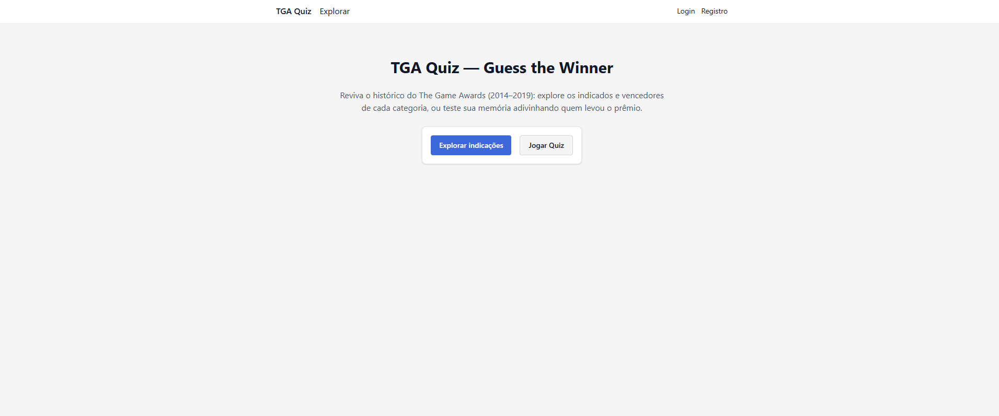
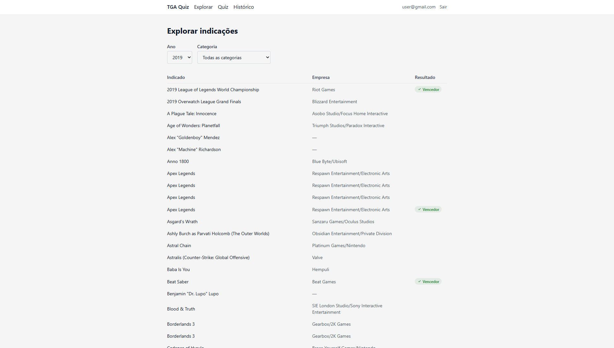
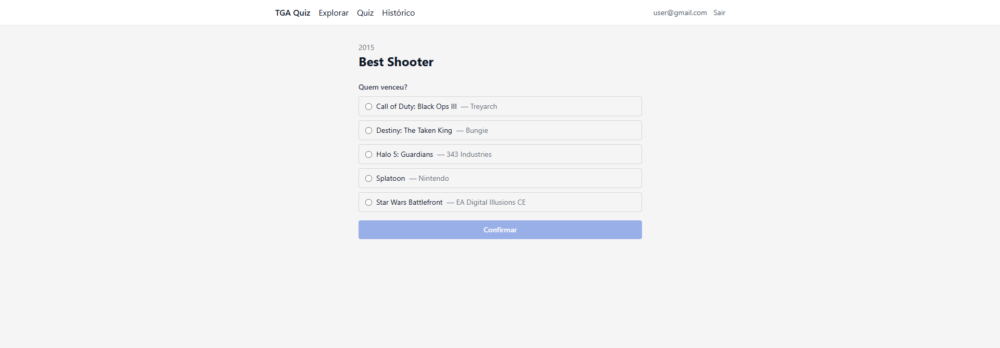
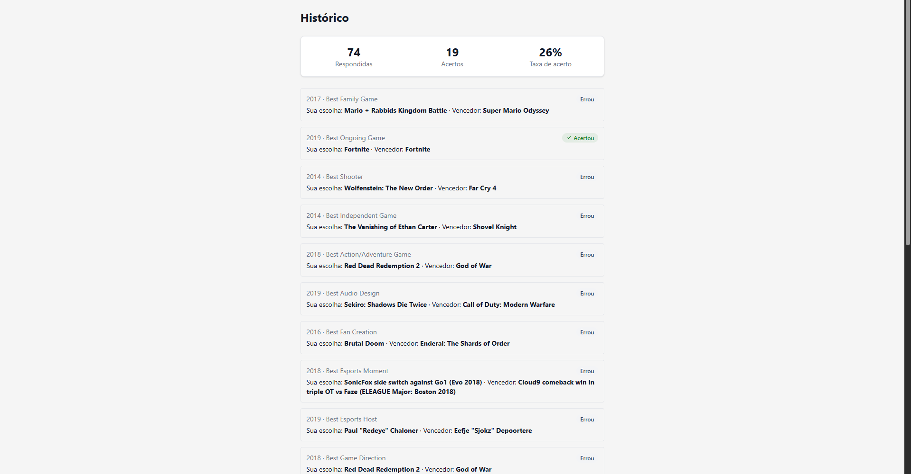

# TGA Quiz (Guess the Winner)

Aplicação full-stack sobre o dataset do The Game Awards (2014–2019, `data/the_game_awards.csv`), com dois modos:

- **Exploração** (público) — navegar indicados e vencedores por ano e categoria.
- **Quiz** (autenticado) — adivinhar o vencedor de cada categoria sem ver a resposta, com histórico e taxa de acerto.

Veja `PRD.md` para o produto, `CLAUDE.md` para as convenções técnicas e `ROADMAP.md` para o plano de implementação em fases.

## Screenshots

### Capa



### Exploração



### Quiz



### Histórico



## Pré-requisitos

- **Node.js** `^20.19 || ^22.12 || >=24.0`
- **Docker Desktop** (para o PostgreSQL via Docker Compose)
- **npm** — o projeto usa npm workspaces; não foi testado com yarn/pnpm

## Setup local

```bash
npm install
docker compose up -d

cp backend/.env.example backend/.env
# edite backend/.env e troque JWT_SECRET por um segredo de 32+ caracteres

cp frontend/.env.example frontend/.env.local

npm run db:migrate -w backend
npm run db:seed -w backend

npm run dev
```

Depois, acesse `http://localhost:3000`. O backend sobe em `http://localhost:4000`.

## Variáveis de ambiente

### `backend/.env`

| Variável | Descrição |
|---|---|
| `NODE_ENV` | `development` \| `test` \| `production` (default `development`) |
| `PORT` | Porta do servidor Express (default `4000`) |
| `DATABASE_URL` | Connection string do PostgreSQL de desenvolvimento |
| `TEST_DATABASE_URL` | Connection string do banco de teste — o **nome precisa terminar em `_test`** (guarda contra apontar testes pro banco de dev) |
| `JWT_SECRET` | Segredo do JWT (HS256), mínimo 32 caracteres |
| `FRONTEND_URL` | Origem permitida no CORS (ex.: `http://localhost:3000`) |

### `frontend/.env.local`

| Variável | Descrição |
|---|---|
| `NEXT_PUBLIC_API_URL` | URL base do backend (ex.: `http://localhost:4000`) |

## Scripts (raiz)

| Script | O que faz |
|---|---|
| `npm run dev` | Sobe backend e frontend juntos em modo desenvolvimento |
| `npm run db:migrate` | Aplica as migrations do Prisma no banco de dev |
| `npm run db:seed` | Popula o banco a partir do CSV (idempotente) |
| `npm run db:reset` | Recria o banco de dev do zero (migrations + seed) |
| `npm test` | Roda a suíte de testes do backend |
| `npm run lint` | ESLint no monorepo inteiro |
| `npm run format` | Prettier — formata todo o repo |
| `npm run typecheck` | `tsc --noEmit` em `backend/` e `frontend/` |

## Rodando os testes

```bash
npm test
```

O banco de teste (`tga_test`) é criado e semeado sozinho pelo `global-setup.ts` do Jest (`prisma migrate deploy` + seed `--force`) — não precisa preparar nada manualmente além de `TEST_DATABASE_URL` estar configurada em `backend/.env`. Uma guarda em `tests/helpers/load-test-env.ts` recusa rodar se o nome do banco não terminar em `_test`, então o banco `tga` de desenvolvimento nunca é tocado pelos testes.

## Notas de deploy

Sem hospedagem real neste projeto — as notas abaixo são escritas para referência, não executadas:

- **Frontend** (`frontend/`) — Vercel. Configurar `NEXT_PUBLIC_API_URL` apontando para a URL pública do backend.
- **Backend** (`backend/`) — Railway ou Render, com um PostgreSQL gerenciado. Configurar `DATABASE_URL`, `JWT_SECRET` e `FRONTEND_URL` (apontando para a URL pública do frontend).
- **Cookie cross-domain** — em produção, frontend e backend normalmente vivem em domínios diferentes. O cookie `tga_token` já é `sameSite: 'none'` + `secure: true` quando `NODE_ENV=production` (`httpOnly` sempre), o que é obrigatório para o navegador aceitar o cookie entre origens distintas via HTTPS.
